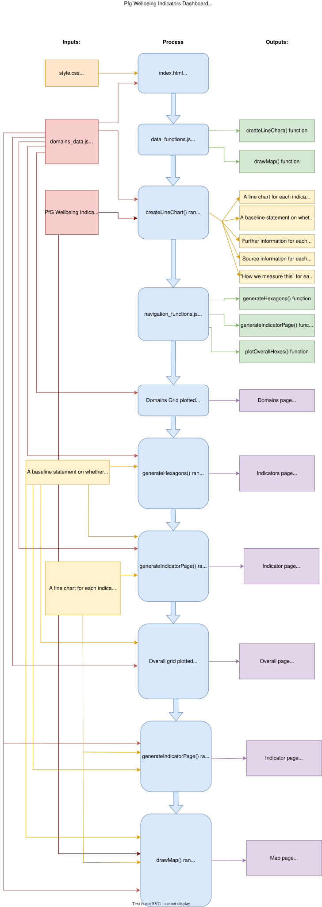
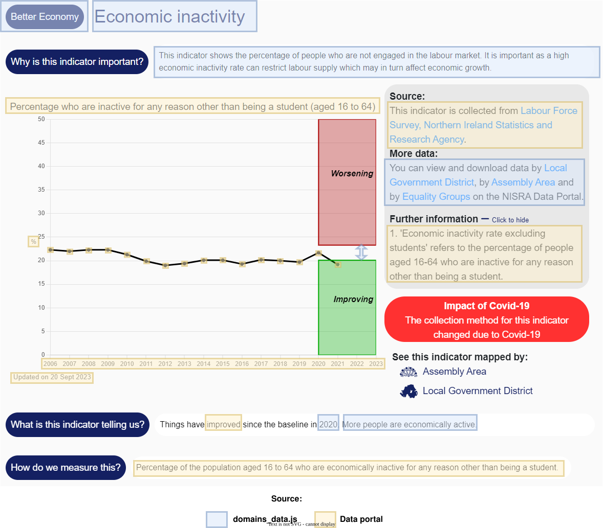

# #50 PfG Wellbeing Framework dashboard

## Table of Contents

- [#50 PfG Wellbeing Framework dashboard](#50-pfg-wellbeing-framework-dashboard)
  - [Table of Contents](#table-of-contents)
  - [:newspaper: Aim](#newspaper-aim)
  - [:house: Structure](#house-structure)
    - [File structure](#file-structure)
    - [Data Input](#data-input)
    - [Code structure](#code-structure)
    - [Software Checklist](#software-checklist)
      - [Git set up](#git-set-up)
  - [:arrows\_clockwise: Processes](#arrows_clockwise-processes)
    - [Process Diagram](#process-diagram)
    - [:information\_source: Indicator sources](#information_source-indicator-sources)
      - [Updating an indicator](#updating-an-indicator)
      - [Adding a new indicator/domain](#adding-a-new-indicatordomain)
    - [Link with Data Portal](#link-with-data-portal)
    - [Update the dashboard with any commentary on trends :chart\_with\_upwards\_trend:](#update-the-dashboard-with-any-commentary-on-trends-chart_with_upwards_trend)
    - [Process for updating code](#process-for-updating-code)
    - [Testing phase :mortar\_board:](#testing-phase-mortar_board)
    - [Datavis hosting :computer:](#datavis-hosting-computer)
    - ['Live' check :sun\_with\_face:](#live-check-sun_with_face)
  - [:warning: Troubleshooting](#warning-troubleshooting)
  - [Frequently Asked Questions](#frequently-asked-questions)
    - [How do we add an indicator?](#how-do-we-add-an-indicator)
    - [How do we add a domain?](#how-do-we-add-a-domain)
    - [How do we move indicators between domains?](#how-do-we-move-indicators-between-domains)
    - [How do we add a new map?](#how-do-we-add-a-new-map)
    - [How do we change improving/worsening on charts?](#how-do-we-change-improvingworsening-on-charts)
    - [How do we add a new page, e.g. about?](#how-do-we-add-a-new-page-eg-about)
    - [How do we hide pages?](#how-do-we-hide-pages)
    - [How do we change branding, logos, etc.?](#how-do-we-change-branding-logos-etc)
    - [How do we change colours of chart, maps, boxes?](#how-do-we-change-colours-of-chart-maps-boxes)
    - [How do we change chart styles?](#how-do-we-change-chart-styles)
    - [How do we move hexagons from between the improving/worsening/no change sections on the Overall page?](#how-do-we-move-hexagons-from-between-the-improvingworseningno-change-sections-on-the-overall-page)
    - [How do we update the accordion boxes on home page and how to include hyperlink functionality if needed?](#how-do-we-update-the-accordion-boxes-on-home-page-and-how-to-include-hyperlink-functionality-if-needed)
    - [How do we fix the title on charts/maps download when it gets cut off?](#how-do-we-fix-the-title-on-chartsmaps-download-when-it-gets-cut-off)
    - [How do we fix the Y-axis on charts download when it overspills?](#how-do-we-fix-the-yaxis-on-charts-download-when-it-overspills)
    - [How does the Performance icon work?](#how-does-the-performance-icon-work)
    - [How do we update the map screen and the map popups' summary text?](#how-do-we-update-the-map-screen-and-the-map-popups-summary-text)
    - [How does the captions on charts/maps downloads work?](#how-does-the-captions-on-chartsmaps-downloads-work)
    - [What parts of the script do we need to update if we move to the live data portal?](#what-parts-of-the-script-do-we-need-to-update-if-we-move-to-the-live-data-portal)
    - [The process of updating GitHub when we make changes?](#the-process-of-updating-github-when-we-make-changes)
    - [What's the process for accessing the internal reporting status of indicators?](#whats-the-process-for-accessing-the-internal-reporting-status-of-indicators)
    - [What's the process for publishing the dashboard?](#whats-the-process-for-publishing-the-dashboard)
  - [:question: Links](#question-links)

## :newspaper: Aim
Documentation to outline the structure and processes needed to create or modify the PfG Wellbeing Framework dashboard.

## :house: Structure

### File structure 

| File | Purpose  |
| --- | --- |
| `index.html` | The dashboard main page |
| `style.css` | Pre-defined styling for the dashboards - colours, fonts, sizing, spacing etc. |
| `domains_data.js` | Additional indicator information |
| `data_functions.js` | JavaScript functionality used for reading data from the Data Portal |
| `navigation_functions.js` | JavaScript functionality used for navigation throughout dashboard |
| `cookies_script.js` | JavaScript functionality for cookies |
| `config.js` | Setup script used to declare which data portal (pre-production or public) to read from |
| `ni_map.js` | JavaScript used to display NI LGD and Assembly Area maps |
| `maps` | Folder containing original shape files for maps |
| `datavis prep base64.R` | R script used to prepare the files for upload to the DataVis server |
| `*.svg, *.gif` | Logos, icons and placeholder images |

### Data Input

Data for the dashboard is directly linked to data available for each indicator stored in the 'Programme for Government' folder on the NISRA Data Portal. The relevant datasets on NISRA Data Portal are linked to the dashboard using an API query. The dashboard will automatically update as data is updated on the NISRA Data Portal provided it is uploaded using the same naming conventions.

The [`domains_data.js`](scripts/domains_data.js) script is an additional 'input' which contains additional domain/indiactor information. 

### Code structure

| Section | Purpose  |
| --- | --- |
| Head | Page title, import css and js dependencies, Google Analytics code and header |
| Body | Header and branding, cookie banner, top menu, overall screen, domains screen, indicator screen, maps screen, user guide, footer |
| Domains Screen | Hexagons for showing the high level domains, clicking a domain shows the indicators for that domain |
| Overall Screen | Hexagons generated for each indicator and categorised as 'improving', 'no change' or 'worsening' based on the data |
| Indicator Screen | Chart.js line chart for each indicator alongside additional information |
| Map Screen | Maps to display indicator data, dropdown menu to swicth between indicators |
| User Guide | Background information on the indicators and their framework |
| Footer | Standard NISRA footer |

### Software Checklist

- Visual Studio Code (with "Live Server" Extension)
- R Studio
- Git for Windows
 
#### Git set up

If you are using Git for the first time follow these configuration steps before cloning the Git Repository:
1. Register an account on github.com with your work email address.
2. Open Visual Studio Code
3. Open a new Terminal, either by clicking `Terminal` in the top menu and choosing `New Terminal` or pressing <kbd>Ctrl</kbd>+<kbd>Shift</kbd>+<kbd>'</kbd>
4. In the Terminal pane enter each line of code, pressing <kbd>Enter</kbd> __after each line__:
    -  `git config --global http.sslVerify false`
    - `git config --global user.name "YourUserName"`
    - `git config --global user.email first.last@nisra.gov.uk`

You will need to enter the username and email address you registered your github.com account with. 

## :arrows_clockwise: Processes

### Process Diagram

The diagram below shows how the functionality behind this dashboard renders all the code. Some parts of the process are _independent_ (they occur automatically as the page loads) and some are _dependent_ (they occur in response to some interaction from the user).

<div style="width: 100%;">
  
</div>

### :information_source: Indicator sources

The diagram below depicts the _Economic inactivity_ indicator page with the source of each page of information on it highlighted. To change or update any piece of information below (for any indicator) refer to this diagram:

<div style="width: 100%; margin-bottom: 20px">
  
</div>

a. __Domain title__ This comes from the _domain_ name found in [`domains_data.js`](scripts/domains_data.js)

b. __Indicator title__ This comes from the _indicator_ name found in [`domains_data.js`](scripts/domains_data.js)

c. __How do we measure this?__ This is taken from the _notes_ object from the NISRA Data Portal query. The contents of the paragraph labelled __How do we measure this__ are extracted.

d. __Chart title__ This is the value of the _label_ object taken from the result of the NISRA Data Portal query.

e. __Source__ This is taken from the _notes_ object from the NISRA Data Portal query. The contents of the paragraph labelled __Notes__ are extracted. The preferred format for source information is: `Title of publication http://link.to.publication`

f. __More data__ This sentence is outputted based on the values present under the _data_ object within each indicator in [`domains_data.js`](scripts/domains_data.js)

g. __y axis label__ This is the value of the _unit_ object taken from the result of the NISRA Data Portal query.

h. __data points__ These are obtained from the _value_ object in the result of the NISRA Data Portal query.

i. __The real change interval__ This is the value of the _ci_ object for the particular indicator found in [`domains_data.js`](scripts/domains_data.js)

j. __Further information__ This is taken from the _notes_ object from the NISRA Data Portal query. The contents of the paragraph labelled __Further information__ are extracted.

k. __x axis values__ These are obtained from the _TLIST(A1)_ object in the result of the NISRA Data Portal query.

l. __Last updated date__  This is obtained from the _updated_ object in the result of the NISRA Data Portal query.

m. __Things have improved/not changed/worsened__ This part of the sentence is outputted based on the results of the NISRA Data Portal Query.

n. __Baseline year__ This is obtained from the _base_year_ value for the particular indicator found in [`domains_data.js`](scripts/domains_data.js). When there is insufficient data available to determine real change set _base_year_ should be set to `null`.

o. __Statement on performance__ This is output as one of the four values (_improved_, _no_change_, _worsened_ or _insufficient_) found under the _telling_ object for the particular indicator in [`domains_data.js`](scripts/domains_data.js) 

p. __Why is this indicator important?__ This is the value of the _importance_ object for the particular indicator found in [`domains_data.js`](scripts/domains_data.js)

q. __Links to maps__ These links are generated if AA or LGD data are listed in [`domains_data.js`](scripts/domains_data.js)

r. __Pop-up charts for Equality Groups__ These links are generated depending on the category values of the _EQUALGROUPS_ variable on the NISRA Data Portal.

#### Updating an indicator

The diagram above, and its footnote, should be referred to when changing any piece of information about an indicator.

If a change is being made within the [`domains_data.js`](scripts/domains_data.js) script then you must follow this up with steps 4-7 in the [Process for updating code](#process-for-updating-code) section below.

Under the _telling_ obect for each indicator you should ensure all placeholder text is complete, even for text which will not be rendered in the current scenario as the indicator performance may change following a data portal update and we don't want to display commentary that contradicts the data displayed on the chart.

#### Adding a new indicator/domain

To add a new indicator to the Data Portal all the information highlighted in yellow above must be entered in the correct place as detailed in the notes below the diagram.

After the new indicator has been added to the Data Portal the [`domains_data.js`](scripts/domains_data.js) script can then be updated with all the items highlighted in blue above. The formatting and object nesting for a typical indicator is described in the commented out code at the top of the script.

After the script has been updated follow steps 4-7 in the [Process for updating code](#process-for-updating-code) section below.

### Link with Data Portal
- Dashboard will automatically update when new data is uploaded to the data portal (provided it is named the same)
- If an indicator is added or changes this will need to be updated in the [`domains_data.js`](scripts/domains_data.js) script.

### Update the dashboard with any commentary on trends :chart_with_upwards_trend:
Commentary on indicator trends should be added to the [`domains_data.js`](scripts/domains_data.js) script.

### Process for updating code

1. Open Visual Studio Code.
2. Run a "Git pull" to ensure code is up to date with repository.
3. Make any changes to the code.
4. Save changes, Stage changes, Commit changes and then Push changes to Github.
5. Open R Studio by double clicking the `scripts.Rproj` file (using Windows Explorer not Visual Studio Code)
6. Run the script `datavis prep base64.R` (Press <kbd>Ctrl</kbd>+<kbd>A</kbd> followed by <kbd>Ctrl</kbd>+<kbd>Enter</kbd>) to embed JavaScript files, images and css stylesheets in the [`index.html`](scripts/index.html) file.
7. This will automatically render a __new copy__ of `index.html` in a sub-folder named `dashboard-to-upload`. Upload __this copy__ of `index.html` to the Datavis server to the same location where it was previously hosted. 

### Testing phase :mortar_board:
When modifications have been made (new data or otherwise), carry out a systematic testing of content:
- Spelling and definitions
- Data is being presented accurately in text, charts, images etc.
- All links are still working e.g. Downloads, share buttons, links to external websites, links that make reference to other parts of the dashboard etc.

### Datavis hosting :computer:
1. Ensure the you are using a self-contained version of [`index.html`](index.html). This can be generated by following steps 5-7 of the [Process for updating code](#process-for-updating-code)
1. Arrange for the file to be uploaded to the DataVis server
1. ITassist will need to create:
   - A subdomain e.g. `wellbeing.nisra.gov.uk`
   - An automatic redirect for that domain to the URL of your dashboard on Datavis

### 'Live' check :sun_with_face:
1. Once the dashboard has gone live, re-run the 'Testing phase' actions from above to ensure they have translated to the DataVis platform
2. Perform checks on mobile devices as necessary to ensure functionality and accessibility

## :warning: Troubleshooting
- Chart isn't appearing
  - This is likely an issue with the live fetch from Data Portal. Open your browsers Dev Tools and check the Console for warnings. Try refreshing the page. If the problem persists, try increasing the wait time in the _setTimeout()_ functions found in [`navigation_functions.js`](scripts/navigation_functions.js) script.
- Source information, Further information or How we measure this not appearing on indicator page
  - Check the "notes" text for that indicator on the Data Portal. Heading should read "Source" "How do we measure this" or "Futher information" and be spelled correctly for _createLineChart()_ and _drawMap()_ functions to pick them up and display them.

## Frequently Asked Questions

### How do we add an indicator?
New indicators are added in the [domains_data.js](scripts/domains_data.js) script. A new indicator must be nested under its Domain. All the properties required for a new indicator are detailed in the annotations at the top of this script.

### How do we add a domain?
New domains are added in the [domains_data.js](scripts/domains_data.js) script. A new domain must be nested at the highest level. All the properties required for a new domain are detailed in the annotations at the top of this script.

### How do we move indicators between domains?
An indicator can be moved between domains by going to the [domains_data.js](scripts/domains_data.js) script and cutting and pasting the properties for that indicator so they are nested under the new domain.

### How do we add a new map?
Maps are automatically generated for any indicator in the [domains_data.js](scripts/domains_data.js) script that has an `LGD` or `AA` dataset declared under its `data` property:

```
data: {
    NI: "",
    AA: "INDPREVDTHAA",
    LGD: "INDPREVDTHLGD",
    EQ: "INDPREVDTHEQ"
}
```

To add a new map:

 1. Upload an LGD/AA dataset to the Data Portal
 2. Under the `data` property for the relevant indicator add the table id under the nested `LGD`/`AA` property

To remove a map:

  1. Set the `LGD`/`AA` property for the indicator to an empty text string `""`

### How do we change improving/worsening on charts?
The properties `base_year`, `ci` and `improvement` for each indicator found in [`domains_data.js`](scripts/domains_data.js) are used to plot the improving/worsening ranges on the charts.

 * `base_year`: This is the base year on which performance is measured against. It should match the format in which the year variable for the indicator is restored. eg("2019", "2019/20", "2019-2021") and always be placed inside quotes.
  
 * `ci`: This is the change interval. It is always given as a positive value. It can be entered one of two ways:
   * If, for example, the improvement was measured as 2% better than the base year value then enter the number 2, with no quotes.
   * If improvement was to be measured as 2% year-on-year then enter "2c" inside quotes.
   In either of the above methods there is no need to enter any units (eg, %, people, kg)

 * `improvement`: This is the change in value that we would see as an improvement for the indicator.
   * If a value that is _higher than the year before_ would be seen as an improvement then enter "increasing".
   * If a value that is _lower than the year before_ would be seen as an improvement then enter "decreasing". 

### How do we add a new page, e.g. about?
There are two changes that need to be made in the [`index.html`](index.html) script to add a page:

 1. Inside the `<div>` element with the id `top-container` there is a `<form>` element with the id `top-menu-items`:
   
    ```
    <form id = "top-menu-items" class = "row" action = "">
      <button id = "domains-btn" class = "top-menu-item selected-item" name = "tab" value = "domains"><i class = "fas fa-chart-line"></i> Domains</button>
      <button id = "overall-btn" class = "top-menu-item" name = "tab" value = "overall"> Overall</button>
      <button id = "maps-btn" class = "top-menu-item" name = "tab" value = "maps"> Maps</button>
      <button id = "about-btn" class = "top-menu-item" name = "tab" value = "about"><i class="fa-regular fa-circle-question"></i></i> About</button>
    </form>
    ```

    It is here we must first add a new `<button>` element. Suppose we want to name the page __"New"__, then we would define the button as follows:

    `<button id = "new-btn" class = "top-menu-item" name = "tab" value = "new">New</button>`

    The `id` and `value` properties must correspond to each other (ie `new-btn` and `new` respectively). The `class` should always be `top-menu-item` and the `name` should always be `tab`.

    Button icons (those found in`<i>` tags) are sourced from [FontAwesome](https://fontawesome.com/icons). Those which are inside `` tags have been sourced online and placed in this projects [`img`](img) directory.

 2. Inside the `<div>` element with the id `main-container` add a new `<div>` element as follows:
   
    ```
    <div id = "new-scrn" class = "screen">
       Page content goes in here
    </div>
    ```
    Note that the `id` of this `div` must always correspond to the `id` and `value` entered when adding the `<button>` element in Step 1.

    That's it. The [`navigation_functions.js`](scripts/navigation_functions.js) script will take care of the rest.  

### How do we hide pages?
Referring to the [question above](#how-do-we-add-a-new-page-eg-notes), there are 2 steps to hiding a page.

 1. Inside the `<form>` with the id `top-menu-items` highlight the corresponding button for that page and press <kbd>Ctrl</kbd> + <kbd>?</kbd>. This will transform that line of code to a text comment.

 2. For the corresponding `<div>` element with the class `screen`. Highlight the code and press <kbd>Ctrl</kbd> + <kbd>?</kbd>.

### How do we change branding, logos, etc.?
This can all be changed in the main [`index.html`](index.html) script. The logos are sourced from the project's [img](img) folder. The main titles, logos etc are located in the `top-container` div and the footer is in the `<footer>` element.

### How do we change colours of chart, maps, boxes?
 * For chart colours, see the `chart_config` definition inside the `createLineChart()` function in the [`data_functions.js`](scripts/data_functions.js) script. See [Chart.js documentation](https://www.chartjs.org/docs/latest/) on ways to make changes.
 * For eqaulity group bar charts, see the `colours` definition inside the `getEqualityGroups()` function in the [`data_functions.js`](scripts/data_functions.js) script.
 * For map colours, see the `drawMap()` function in the [`data_functions.js`](scripts/data_functions.js) script. See [leaflet.js documentation](https://leafletjs.com/reference.html) on how to customise maps.
 * For boxes, see the [`style.css`](style.css) stylesheet. Find the corresponding id or class of the page element you wish to change and change the `background-color` property.

### How do we change chart styles?
See the `chart_config` definition inside the `createLineChart()` function in the [`data_functions.js`](scripts/data_functions.js) script. See [Chart.js documentation](https://www.chartjs.org/docs/latest/) on ways to make changes.

### How do we move hexagons from between the improving/worsening/no change sections on the Overall page?
This is done automatically.

The `indicatorPerformace()` function in the [`data_functions.js`](scripts/data_functions.js) script will categorise each indicator based on its performance.

The `plotOverallHexes()` function in the [`navigation_functions.js`](scripts/navigation_functions.js) script then plots the hexagons on the Overall based on the results of `indicatorPerformace()`.

The `indicatorPerformance()` function obtains the data values for each indicator from the Data Portal. It then uses the properties `base_year`, `ci` and `improvement` for each indicator found in [`domains_data.js`](scripts/domains_data.js) to determine performance. There is more information on how each of these properties should be defined in the annotations in this script.

### How do we set up data downloads for new indicators and subpopulations?

There is no additional process other than the process for adding a new indicator. Data downloads are automatically rendered so long as the indicator is on the dashboard and the subpopulation is listed in `eq_groups.js`.

### How do we alter the Y axis label if it doesn't display the same thing on the subpopulation charts as on the NI chart?

This is handled by the two functions that populate the subpopulation and NI charts; `renderPopup()` and `createLineChart()` respectively. In `renderPopup()`, an object called `y_axis.textContent` extracts the label dimension from the data pulled from the data portal; in `createLineChart()`, the same job is done by an object called `y_axis_label`. Immediately below where both objects are declared, there is an if statement which alters the label for specific indicators. These if statements are currently identical, but if one is altered without altering the other, the contents of the y axis labels on the two charts for that indicator will be different. Simply add another line to the if statement to alter the y axis label on one or both charts for a given indicator if desired.

### How do we update the accordion boxes on home page and how to include hyperlink functionality if needed?
Updating the 'populateInfoBoxes' in the [`data_functions.js`](scripts/data_functions.js) script. This function takes two arrays:
- An array of accordion titles/questions
- A matching array of text wrapped in (`<p>`) tags containing the accordion content/answers

#### Adding hyperlinks to accordions
Hyperlink functionality can be added within the accordions by using (`<a>`) tags.

To add a hyperlink:
- Use an `<a>` tag with a valid `href`
- Include `target="_blank"` to open the link in a new browser tab
- Provide the link between the opening and closing `<a>` tags

For example, the current accordion hyperlink is defined as:

```
<a href="https://datavis.nisra.gov.uk/executiveofficeni/technical_report.xlsx" target="_blank">
  Technical Report
</a>
```

### How do we fix the title on charts/maps download when it gets cut off?
Titles on downloaded charts and maps are rendered into a fixed‑size image canvas during export.

Across charts and maps, the same general approach is used:
- A maximum title width is enforced so text does not exceed the image width (`maxTitleWidth`)
- The `titleText` is wrapped onto multiple lines using the `wrapCanvasText()`function once it reaches the `maxTitleWidth`
- The total title height is calculated dynamically based on the number of wrapped lines to ensure enough vertical space is reserved

#### Making adjustments
If a title is still being cut off or requires more space, these values can be adjusted directly in the relevant download functions within the [`navigation_functions.js`](scripts/navigation_functions.js) script:

- **Indicator screen charts**  
  Adjust values inside the `downloadChartAsImage()` function  
  (e.g. `maxTitleWidth` or `titleLineHeight`)

- **Map screen downloads**  
  Adjust values inside the `downloadMapAsImage()` function  
   (e.g. `maxTitleWidth` or `lineHeight`)

- **Map popup downloads**  
  Adjust values inside the `downloadPopUpMapImage()` function  
   (e.g. `maxTitleWidth` or `titleLineHeight`)

- **Chart popup downloads**

  Adjust values inside the `download_btn.onclick` function inside `renderPopUp()` within the [`data_functions.js`](scripts/data_functions.js) script
  (e.g. `maxTitleWidth` or `titleLineHeight`)
  
Changing these values will directly affect how much horizontal and vertical space is allocated to titles during export and can be used to prevent clipping for longer titles.

### How do we fix the Y-axis on charts download when it overspills?
Y-axis on downloaded charts are rendered during export.

Across indicator screen charts and chart popup downloads, the same general approach is used:
- Y-axis label is extracted using the `getYLabel` function and stored in `yLabel`
- `yPadding` is applied to allow horizontal space for the `yLabel`
- `leftInset` allows for additional space to the left of the `yLabel`
- `lineHeight` is set to 14, ensuring enough vertical spacing between each line of the `yLabel`

Changing these values will directly affect how much horizontal and vertical space is allocated to y-axis labels during export and can be used to prevent clipping for longer labels.

### How does the Performance icon work?
The Performance icon is **generated automatically**.

Performance is calculated dynamically within the `createLineChart()` function in the [`data_functions.js`](scripts/data_functions.js) script.

#### How the Performance status is determined
- Performance is assessed by comparing the most recent data point with the defined `base_year`
- Based on this, a `base_statement` is generated

#### How the Performance icon is selected
Four predefined Performance icon HTML blocks are defined in the [`data_functions.js`](scripts/data_functions.js) script.
- improvinghexDivHTML
- nochangehexDivHTML
- worseninghexDivHTML
- insufficienthexDivHTML

After the `base_statement` is created, its text content is checked for keywords (e.g. *improved*, *worsened*, *no real change*, *insufficient*). The matching Performance icon is then selected and injected into the page automatically.

### How do we update the map screen and the map popups' summary text?
#### Map screen
Map screen-up captions are generated using the `setMapSummary()` function in the [`data_functions.js`](scripts/data_functions.js) script.

This function constructs a summary sentence using:
- `base_sentence` - the fixed introductory text *“A map of Northern Ireland for the year”*. If the selected map year is a range (i.e. contains a hyphen), this is automatically updated to *“A map of Northern Ireland for the years”*.
- `mapYear` - extracts the text content inside JS element `date_display`
- `summarySign` - the corresponding units for the caption
- `lowestAreaText` - a formatted list of area(s) with the lowest value
- `highestAreaText` - a formatted list of area(s) with the highest value
- `lowestWording` - automatically set to **“value was”** or **“values were”**, depending on whether one or multiple lowest areas exist
- `highestWording` - automatically set to **“value was”** or **“values were”**, depending on whether one or multiple highest areas exist

A caption is then assigned to `summary`, using the following logic:

```
let summary = `${baseSentence} ${mapYear}. The lowest ${lowestWording} ${lowestAreaText} with ${lowestValue}${summarySign} and the highest ${highestWording} ${highestAreaText} with ${highestValue}${summarySign}.`;
```

#### Map popups
Map pop-up captions are generated using the `setPopupSummary()` function in the [`data_functions.js`](scripts/data_functions.js) script.

This function constructs a summary sentence using:
- `base_sentence` - the fixed introductory text: "A map of Northern Ireland"
- `yearEl` - the HTML element containing the map year label displayed above the slider
- `labelEl` - the HTML element containing the Y-axis label of the indicator's line chart, used to later create `summarySign`
- `titleEl` - the HTML element containing the indicator's line chart title
- `measureText` - the indicator's measure text
- `match` - checks if 'For this indicator a' exists within `measureText`
- `measureInfo` - if `match` is found inside `measureText`, the sentence is injected. If not, an empty string is returned
- `lowHighSentence` - dynamically constructed sentence describing:
  - The area(s) with the lowest value (`lowestAreaText`)
  - The area(s) with the highest value (`highestAreaText`)
  - The corresponding values and units (`summarySign`)
    This sentence adapts automatically for singular or multiple areas using functions `formatAreaList()` and `valueWording()`
- `yearText` - uses the extracted text inside `yearEl` and constructs a sentence

A caption is then assigned to `altText`, using the following logic:

```
   let altText;
   if (measureInfo) {
      altText = `${baseSentence} ${yearText} ${lowHighSentence} ${measureInfo}.`;
   } else {
      altText = `${baseSentence} ${yearText} ${lowHighSentence}`;
   }
```

Then, the text is assigned to an HTML element (`.popup-map-summary-text`)

#### Optional additional commentary
Both map screen and map pop‑up captions can optionally include additional manual commentary defined in the `map_commentary` property within the scripts/domains_data.js script.

- If `map_commentary` contains text, this commentary is appended to the automatically generated map caption for both map screens and map pop‑ups.
- If `map_commentary` is an empty string (the default), no additional commentary is added and only the automatically generated caption is displayed.

### How does the captions on charts/maps downloads work?
#### Charts
Chart summaries are injected only at the point of download.

Chart captions are generated using the `chartSummary()` function in the [`data_functions.js`](scripts/data_functions.js) script.

This function constructs a summary sentence using:
- `labelEl` - the Y-axis label of the indicator's line chart
- `titleEl` - the indicator's line chart title
- `unit` - derived from `labelEl` and `titleEl` using the `getChartSummarySign()` function which determines the appropriate unit of measurement
- `measureText` - the indicator's measure text
- `match` - checks if 'For this indicator' exists within `measureText`
- `measureInfo` - if `match` is found inside `measureText`, the sentence is injected. If not, an empty string is returned
- `comparison_year_value` and `comparison_year` - the indicator value and year used as the baseline for performance comparison, where available
- `latest_value` and `latest_year` - the most recent data point and associated year for the indicator
- `changeText` - the indicator's change text, taken from the `#change-info`element
- `changeInfo` - used to extract the first sentence from `changeText` (e.g. *Things have improved since...*)

The chart summaries are injected using the following logic within the `downloadChartAsImage()` function in the [`navigation_functions.js`](scripts/navigation_functions.js) script:

```
let summaryText = (typeof chartSummary === "function") ? chartSummary() : "";
```

#### Map screen
Map screens' summaries are injected only at the point of download.

Map screens' captions are generated inside the `downloadMapAsImage()` function in the [`navigation_functions.js`](scripts/navigation_functions.js) script, using:

- `summaryEl` - selects the HTML element ('summary-map') containing the indicator's summary text
- `summary` - extracts the text content inside `summaryEl`
- `measureEl` – selects the HTML element (`#measure-info-map`) containing the indicator’s measure text for maps
- `measure` – extracts the full text content from `measureEl`
- `measureMatch` - checks if 'For this indicator a' exists within `measure`
- `measureFiltered` - if `measureMatch` is found inside `measure`, the sentence is injected. If not, an empty string is returned

The Map screens' summaries are injected using the following logic:

```
const summaryText = summary + ' ' + measureFiltered;
```

#### Map popups
Unlike map screens and chart downloads (where summaries are injected only at the point of download), map popups summaries are shown on screen.

Map pop-ups' captions are inserted into the downloads within the `downloadPopUpMapAsImage()` function in the [`navigation_functions.js`](scripts/navigation_functions.js) script, using:

- `summaryEl` - selects the HTML element for the existing summary ('.popup-map-summary-text')
- `summaryText` - extracts the text content inside `summaryEl`

### Do the last updated dates all pull from the same place?

Yes. Updating the `latest_update` value for a given indicator in `domains_data.js` will update it everywhere in the dashboard. The same is true of `next_update`.

### Will the same logic automatically apply for new indicators when they're added?

Yes. The only thing that would need updated is [`domains_data.js`](scripts/domains_data.js), as described in the process for adding new indicators - there are some new fields there as a result of the changes, but everything else is handled by the scripts.

### What parts of the script do we need to update if we move to the live data portal?
Updating the `baseURL` value in the [`config.js`](scripts/config.js) script to read from the live data portal will point all data portal queries to the new location.

Updating the `tableURL` value in this script will ensure that all links in the "More data" section are updated.

### The process of updating GitHub when we make changes?
See [Process for updating code](#process-for-updating-code).

### What's the process for accessing the internal reporting status of indicators?
Internal reporting on the status of indicators is generated automatically using a scheduled GitHub actions workflow.

The workflow is defined in:
- `.github/workflows/monthly-performance-summary.yml`

The workflow:
- **Runs on the first day of every month at 12:00am**
- Executes the R script `scripts/indicator-performance-table.R`
- Pulls the latest indicator data
- Writes the output to `backup/indicator-performance-summary.RDS`
- Commits any updates back to the repo with the commit message **“Data updated”** from the **PfGAnalytics** GitHub account

#### How do we make changes to the information being pulled?
If any changes are required, they should be make directly in `scripts/indicator-performance-table.R`, using the in-line comments as a guide

### What's the process for publishing the dashboard?
See [Datavis hosting :computer:](#datavis-hosting-computer).


## :question: Links
- [Chart.js documentation](https://www.chartjs.org/docs/latest/)
- [Chart.js YouTube tutorials](https://www.youtube.com/c/ChartJS-tutorials)
- [leaflet.js documentation](https://leafletjs.com/reference.html)
- [CSS / styling guide on W3schools](https://www.w3schools.com/Css/)
- [HTML guide on W3schools](https://www.w3schools.com/html/default.asp)
- [Javascript guide on W3schools](https://www.w3schools.com/js/default.asp)
- [Free introductory html/css/js courses](https://www.codecademy.com/)
- [Test HTML/css/javascript on web sandbox - DO NOT UPLOAD SENSITIVE DATA](https://jsfiddle.net/)
- [Visual Studio Code documentation](https://code.visualstudio.com/Docs)
- [Github.com documentation](https://docs.github.com/en)
- [R cheatsheet PDFs](https://github.com/rstudio/cheatsheets)
